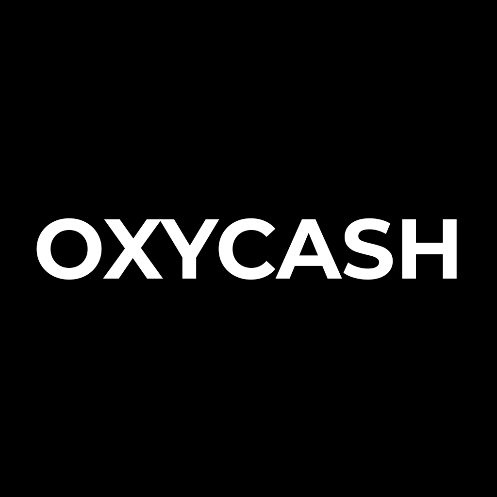

# Oxycash
### Rust portable GUI budget app.
---
## Languages supported
- English
- French
---
## Platforms
| | Android | Linux ARM64 | Linux x64 | Mac ARM64 | Windows x64 |
|---|:---:|:---:|:---:|:---:|:---:|
| Oxycash | ✅ | ✅ | ✅ | 🛠️ | ✅ |
---
## Building from source
### Android
* cargo apk build
### Linux Arm
* cargo build --features="desktop" --target=aarch64-unknown-linux-gnu
### Linux64, Windows
* cargo build --features="desktop"
---
## Quick Start

1. Download the latest release from [Releases](../../releases)
2. Run the executable - no installation needed
3. Set up your profile, it will be stored in a JSON
4. You can import or export JSON profile or CSV and OFX data
5. You can use it locally or through Webdav
6. Enjoy !
---
## License

This project is licensed under the GNU General Public License v3.0 — see Licenses.md for details.

---
## Roadmap
## 🔴 NOW
- Tabs
   - salary
   - labels,  piece n°, descrition, activity, category, Deposit, Withdraw, VAT, account, notes, categories of payment
   - logistic
   - interoperability through oyxshop
   - disable tabs
   - Add tab
## 🟡 NEXT
 - ### Release:
   - Chocolatey
   - MS Store
   - Winget
## 🔵 LATER
---